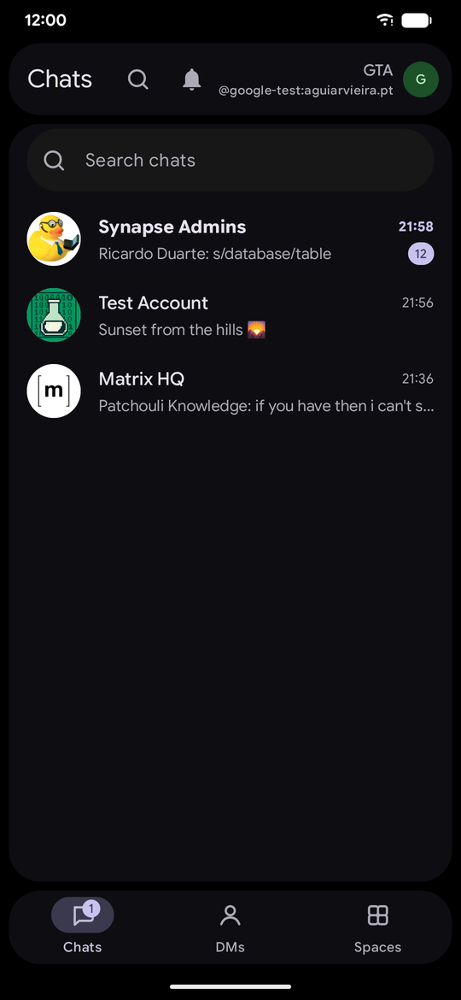
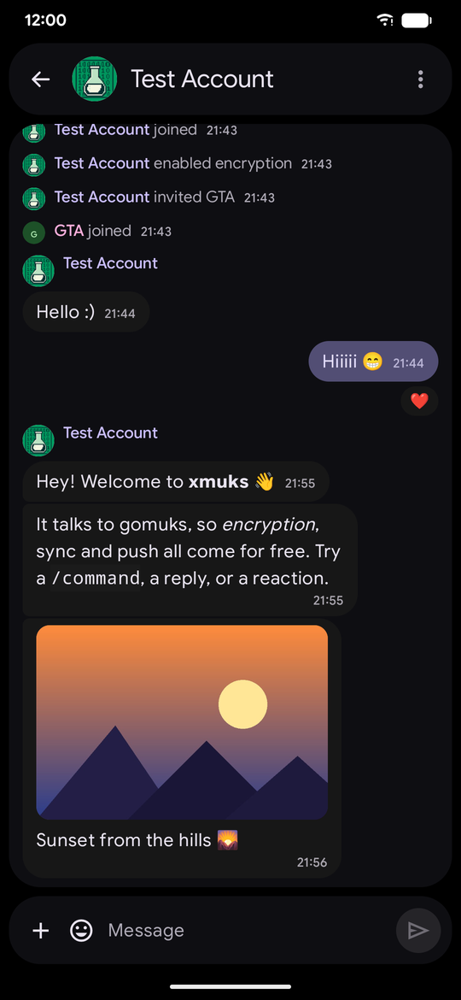
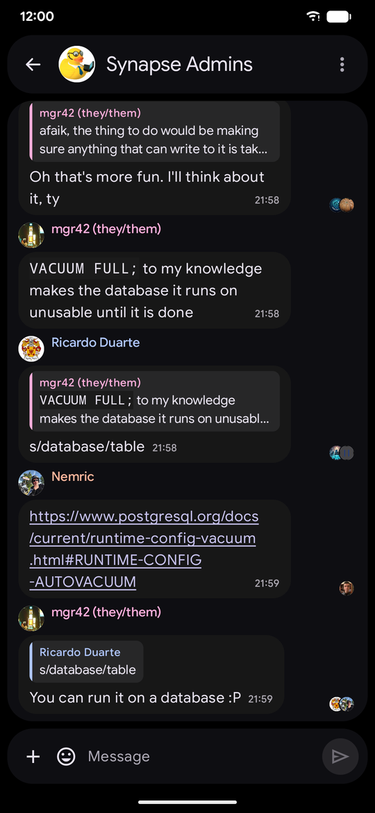
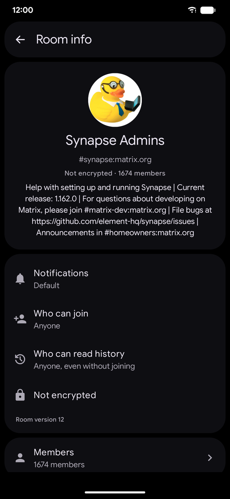
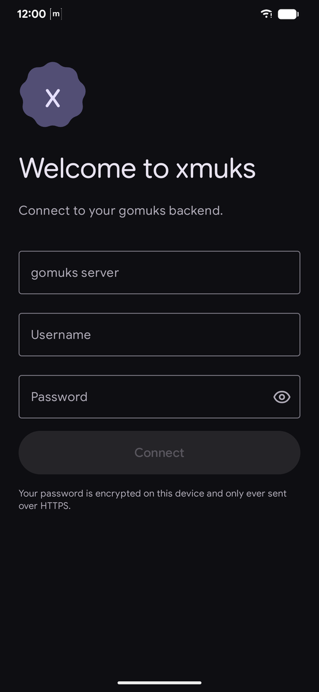
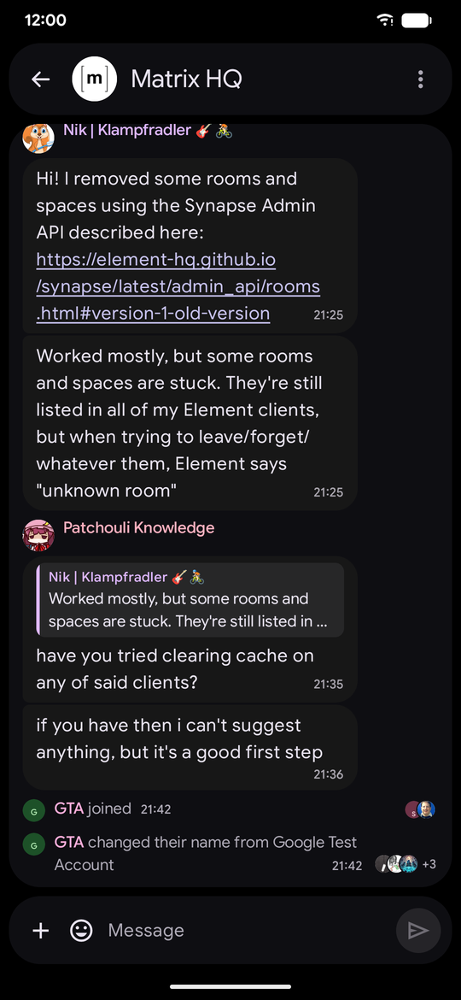
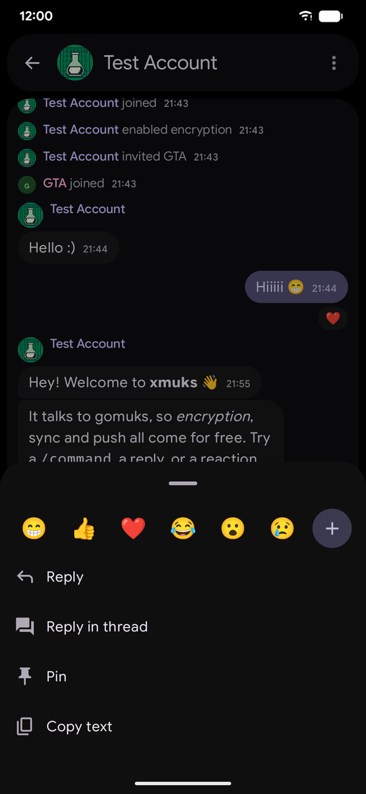
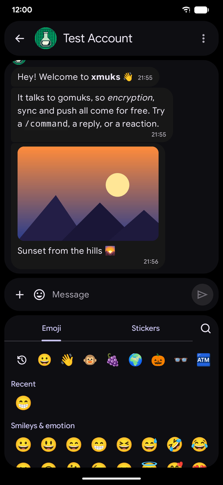
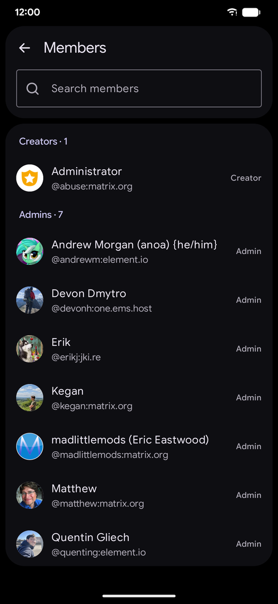
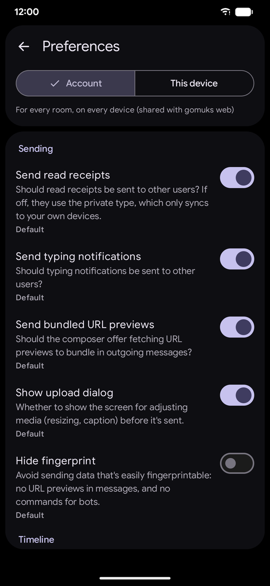

# xmuks

A native Android client for [gomuks](https://github.com/gomuks/gomuks), the always-on Matrix client.

gomuks does the Matrix work (sync, end-to-end encryption, push) on a server you run; xmuks is a fast,
Material 3 Expressive front end for it on your phone. It opens instantly from its own cache, keeps up live
while you're looking, and gets notifications through gomuks' push when you're not.

<p align="center">
  
  
  
  
</p>

## Features

**Rooms**
- Chats, DMs and spaces (with subspaces), unread counts and mention badges, search
- Bridged rooms show their network's logo (WhatsApp, Telegram, Instagram…), with delivery ticks for your messages
- Long-press a room: favourite, low priority, mute, mark read, add a home-screen shortcut
- Past notifications, and message search across rooms (gomuks' own index, encrypted rooms included, or the server's)

**Timeline**
- Formatted messages (markdown, code, quotes, lists, spoilers, mentions, custom emoji), link previews
- Images, GIFs, videos and voice messages that play in place, stickers, locations, files
- Replies, threads, reactions, edits with their history, deletions, polls, pinned messages
- Read receipts that move from message to message, typing, jump to the first unread
- Per-message profiles (MSC4144) and room-specific names and avatars

**Writing**
- Markdown, replies and threads, edits, `@` and `#` completion, gomuks and bot `/commands`
- Photos, videos and files (several at once), voice messages, locations, polls, emoji and sticker packs
- A durable outbox: messages survive the app being killed and are never sent twice
- Share to xmuks from any app, including Android's Direct Share

**Rooms and people**
- Room info: name, topic, avatar, who can join, history visibility, encryption, members by power level,
  moderation, the room's media as a gallery, and its raw state
- Profiles with room-specific and global names, mutual rooms, starting a DM, ignoring

**Notifications**
- One conversation per room, with the room's and senders' avatars, pictures, and inline reply and mark as read
- Android Auto: read aloud and reply from the car
- Per-room notification settings, shared with gomuks

**Everything else**
- gomuks' preferences (per account, device, room, and room on this device), shared with gomuks web
- Dynamic colour, light and dark themes, predictive back, shared-element transitions, a baseline profile

## Screenshots

| | | |
|:-:|:-:|:-:|
|  |  |  |
| Connect to your gomuks | Your rooms | A direct message |
|  |  |  |
| Replies, code and receipts | A busy public room | Long-press a message |
|  |  |  |
| Emoji and stickers | Room info | Members by power level |
|  | | |
| gomuks' preferences | | |

## How it talks to gomuks

- `GET /_gomuks/sse` (jsonl + zstd) for live data while the app is open, resuming with `last_server_ts`
- `POST /_gomuks/exec/{command}` for everything outbound, with `txn_id` idempotency
- FCM pushes (via the gomuks push gateway) while it is closed, encrypted end to end with a key only the app holds

You need a running gomuks (with its web API reachable over HTTPS) and its username and password.

## Building

Requires JDK 21 and the Android SDK with `platforms;android-37.1` and `build-tools;37.0.0`.

```bash
./gradlew :app:assembleDebug          # debug APK
./gradlew testDebugUnitTest           # JVM unit tests (Robolectric, no emulator)
./gradlew verifyRoborazziDebug        # screenshot tests against committed goldens
./gradlew recordRoborazziDebug        # re-record goldens after an intended UI change
./gradlew spotlessApply detekt lintDebug
./gradlew :app:generateReleaseBaselineProfile   # on a connected, logged-in device
```

CI (`.github/workflows/ci.yml`) runs the same checks with `-PwarningsAsErrors=true` on every push. A `vX.Y.Z` tag
matching `versionName` also uploads the AAB to the Play internal track and cuts a GitHub Release.

Release signing reads `keystore.properties` (gitignored) or the `KEYSTORE_FILE`, `KEYSTORE_PASSWORD`, `KEY_ALIAS`,
`KEY_PASSWORD` environment variables; without them the release build is unsigned.

## Modules

| Module | Purpose |
|---|---|
| `app` | Single activity, navigation, DI entry point, share intents, background catch-up |
| `core:protocol` | gomuks' wire types (sync frames, events, RPC payloads) |
| `core:network` | The SSE stream and `/exec` client, reconnects and resumes |
| `core:database` | The local cache the UI reads (rooms, spaces, previews, members, account data) |
| `core:data` | Repositories: sync ingestion, timelines, the outbox, media, preferences, search |
| `core:richtext` | gomuks' sanitised HTML to Compose text |
| `core:push` | FCM, push decryption, notifications, Android Auto, shortcuts |
| `core:designsystem` | M3 Expressive theme (Google Sans Flex, dynamic colour), shared components |
| `feature:login` | Connecting to a gomuks backend |
| `feature:roomlist` | Chats, DMs, spaces, notifications and search |
| `feature:room` | The timeline, the composer, threads, polls, the media gallery |
| `feature:media` | The full-screen image and video viewer |
| `feature:profile` | Profiles, room info, members, room previews |
| `feature:settings` | gomuks' preferences |
| `feature:share` | Sharing into xmuks from other apps |
| `baselineprofile` | Generates the app's baseline profile on a device |
| `build-logic` | Convention plugins (`xmuks.android.*`, `xmuks.hilt`, `xmuks.screenshots`) |

## Licences

Google Sans Flex is bundled under the SIL Open Font License (`core/designsystem/src/main/assets/licenses`).
